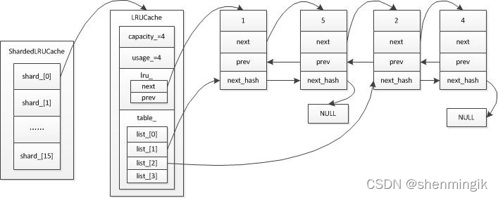

# 缓存设计源码分析！

上一章我们分析了读流程，里面提到了state下的Match函数通过table_cache来读文件，大致的读顺序是：

查cache，有则返回，无则打开文件，并将文件加入缓存，最终在缓存里找到KV。

以上流程大致可以拆成三个部分介绍。

## 1. 与缓存相关的结构体

体积从小到大是：LRUHandle < LRUCache < ShardedLRUCache < TableCache。放一张图留一个大体印象：



为了逻辑清晰，还是从大到小依次介绍：

### 1.1 TableCache

先看查Cache的入口函数Match：

```C++
state->s = state->vset->table_cache_->Get(*state->options, f->number,
                                          f->file_size, state->ikey,
                                          &state->saver, SaveValue);
```

可以看到他是调用了VersionSet下面的table_cache的Get，那再来看看table_cache的定义：

```C++
class VersionSet {
  ...
 private:
  TableCache* const table_cache_;
  ...
}

class TableCache {
 public:
  TableCache(const std::string& dbname, const Options& options, int entries);

  TableCache(const TableCache&) = delete;
  TableCache& operator=(const TableCache&) = delete;

  ~TableCache();

  Iterator* NewIterator(const ReadOptions& options, uint64_t file_number,
                        uint64_t file_size, Table** tableptr = nullptr);
	
  // 上面调用的Get方法
  Status Get(const ReadOptions& options, uint64_t file_number,
             uint64_t file_size, const Slice& k, void* arg,
             void (*handle_result)(void*, const Slice&, const Slice&));

  void Evict(uint64_t file_number);

 private:
  // Get方法内的核心方法
  Status FindTable(uint64_t file_number, uint64_t file_size, Cache::Handle**);

  Env* const env_;
  const std::string dbname_;
  const Options& options_;
  
  // 缓存
  Cache* cache_;
};
```

可以看到它是对核心缓存结构的包裹，且向外提供一个查找和手动淘汰文件的方法。

那么我们就来分析一下Get到底做了什么，我认为可以分为两个部分来讲：

1. **Get**

代码如下：

```C++
Status TableCache::Get(const ReadOptions& options, uint64_t file_number,
                       uint64_t file_size, const Slice& k, void* arg,
                       void (*handle_result)(void*, const Slice&,
                                             const Slice&)) {
  Cache::Handle* handle = nullptr;
  // 找到对应的SSTable
  Status s = FindTable(file_number, file_size, &handle);
  if (s.ok()) {
    Table* t = reinterpret_cast<TableAndFile*>(cache_->Value(handle))->table;
    // 在table内部进行查找，放入handle_result
    s = t->InternalGet(options, k, arg, handle_result);
    // 解引用
    cache_->Release(handle);
  }
  return s;
}
```

代码非常简练，先找到对应的Table，这里的table相当于file_num对应的SSTable文件，然后在文件内查找，如何找到table文件（缓存）就要看FindTable做了什么。

2. **FindTable**

```C++
Status TableCache::FindTable(uint64_t file_number, uint64_t file_size,
                             Cache::Handle** handle) {
  Status s;
  char buf[sizeof(file_number)];
  EncodeFixed64(buf, file_number);
  Slice key(buf, sizeof(buf));
  // 从这里上下的操作可以看到，cache的<k,v>里的Key是file_num
  *handle = cache_->Lookup(key);
  
  if (*handle == nullptr) {
    // 如果缓存里没找到，就去打开它
  	// 根据file_num还原SSTable文件名，在新版中，SSTable文件以.ldb结尾的
    std::string fname = TableFileName(dbname_, file_number);
    RandomAccessFile* file = nullptr;
    Table* table = nullptr;
    s = env_->NewRandomAccessFile(fname, &file);
    if (!s.ok()) {
      // 这是对老版的兼容，老版SSTable后缀是.sst
      std::string old_fname = SSTTableFileName(dbname_, file_number);
      if (env_->NewRandomAccessFile(old_fname, &file).ok()) {
        s = Status::OK();
      }
    }
    
    // 找到对应文件并打开
    if (s.ok()) {
      s = Table::Open(options_, file, file_size, &table);
    }

    if (!s.ok()) {
      assert(table == nullptr);
      delete file;
      // We do not cache error results so that if the error is transient,
      // or somebody repairs the file, we recover automatically.
    } else {
      // 打开成功，将缓存插入cache
      TableAndFile* tf = new TableAndFile;
      tf->file = file;
      tf->table = table;
      *handle = cache_->Insert(key, tf, 1, &DeleteEntry);
    }
  }
  return s;
}
```

可以从上面的代码里看出，TableCache存在的另一个意义就是缓存的调度，如果目标没命中缓存，就把数据从文件中读出来加入缓存。InternalGet函数涉及到读SSTable文件，先挖个坑 : )

那么cache内部如何运作就要深挖一下这个cache了。

### 1.2 ShardedLRUCache

先看这个Cache是什么东西：

```C++
class LEVELDB_EXPORT Cache {
 public:
  Cache() = default;

  Cache(const Cache&) = delete;
  Cache& operator=(const Cache&) = delete;

  // Destroys all existing entries by calling the "deleter"
  // function that was passed to the constructor.
  virtual ~Cache();

  // Opaque handle to an entry stored in the cache.
  struct Handle {};
  virtual Handle* Insert(const Slice& key, void* value, size_t charge,
                         void (*deleter)(const Slice& key, void* value)) = 0;
  virtual Handle* Lookup(const Slice& key) = 0;
  virtual void Release(Handle* handle) = 0;
  virtual void* Value(Handle* handle) = 0;
  virtual void Erase(const Slice& key) = 0;
  virtual uint64_t NewId() = 0;
  virtual void Prune() {}
  virtual size_t TotalCharge() const = 0;
};
```

原来是个接口性质的基类，那么谁来实现它了呢，看看标题就知道了……

```C++
static const int kNumShardBits = 4;
static const int kNumShards = 1 << kNumShardBits;

class ShardedLRUCache : public Cache {
 private:
  LRUCache shard_[kNumShards];		// 对缓存进行分片，减少锁冲突
  port::Mutex id_mutex_;					// 一个专门为修改last_id_上的锁……用原子变量不好吗……
  uint64_t last_id_;							// 每一个cache的table都有一个唯一的id
	...
};

```

好怪的写法，把私有内容写在最上面……

然后再来看它的一些方法：

```C++
class ShardedLRUCache : public Cache {
 private:
	...
    
  // 算Key的哈希值
  static inline uint32_t HashSlice(const Slice& s) {
    return Hash(s.data(), s.size(), 0);
  }
	
  // 根据哈希值算出Key所在的分片
  static uint32_t Shard(uint32_t hash) { return hash >> (32 - kNumShardBits); }

 public:
  explicit ShardedLRUCache(size_t capacity) : last_id_(0) {
    // 算出每个分片的大小，+ kNumShards - 1是为了向上取整
    const size_t per_shard = (capacity + (kNumShards - 1)) / kNumShards;
    for (int s = 0; s < kNumShards; s++) {
      shard_[s].SetCapacity(per_shard);
    }
  }
  ~ShardedLRUCache() override {}
  // 可以看出这个结构体就是一个中转站，算出哈希，找到分片，然后由LRUCache做具体操作
  Handle* Insert(const Slice& key, void* value, size_t charge,
                 void (*deleter)(const Slice& key, void* value)) override {
    const uint32_t hash = HashSlice(key);
    return shard_[Shard(hash)].Insert(key, hash, value, charge, deleter);
  }
  Handle* Lookup(const Slice& key) override {
    const uint32_t hash = HashSlice(key);
    return shard_[Shard(hash)].Lookup(key, hash);
  }
  void Release(Handle* handle) override {
    LRUHandle* h = reinterpret_cast<LRUHandle*>(handle);
    shard_[Shard(h->hash)].Release(handle);
  }
  void Erase(const Slice& key) override {
    const uint32_t hash = HashSlice(key);
    shard_[Shard(hash)].Erase(key, hash);
  }
  void* Value(Handle* handle) override {
    return reinterpret_cast<LRUHandle*>(handle)->value;
  }
  // 所以为什么不用原子变量做这个事呢
  uint64_t NewId() override {
    MutexLock l(&id_mutex_);
    return ++(last_id_);
  }
  // 还没看，销毁Cache？
  void Prune() override {
    for (int s = 0; s < kNumShards; s++) {
      shard_[s].Prune();
    }
  }
  // 计算总大小
  size_t TotalCharge() const override {
    size_t total = 0;
    for (int s = 0; s < kNumShards; s++) {
      total += shard_[s].TotalCharge();
    }
    return total;
  }
};
```

这里就很明显了，这个结构体就是一个中转站，对数据进行分片，然后帮助增删改查请求定位分片，增大并发。

很明显它也不算是缓存的主力，真正干活的是LRUCahe。

### 1.3 LRUCache

看看缓存的主力军长什么样：

```C++
class LRUCache {
 public:
  LRUCache();
  ~LRUCache();

  // 初始化用的，设置LRU容量
  void SetCapacity(size_t capacity) { capacity_ = capacity; }

  // Like Cache methods, but with an extra "hash" parameter.
  Cache::Handle* Insert(const Slice& key, uint32_t hash, void* value,
                        size_t charge,
                        void (*deleter)(const Slice& key, void* value));
  Cache::Handle* Lookup(const Slice& key, uint32_t hash);
  void Release(Cache::Handle* handle);
  void Erase(const Slice& key, uint32_t hash);
  void Prune();
  size_t TotalCharge() const {
    MutexLock l(&mutex_);
    return usage_;
  }

 private:
  void LRU_Remove(LRUHandle* e);
  void LRU_Append(LRUHandle* list, LRUHandle* e);
  void Ref(LRUHandle* e);
  void Unref(LRUHandle* e);
  bool FinishErase(LRUHandle* e) EXCLUSIVE_LOCKS_REQUIRED(mutex_);

  // 最大容量，只会在SetCapacity里面修改
  size_t capacity_;

  // 对LRU的操作都要加锁
  mutable port::Mutex mutex_;
  size_t usage_ GUARDED_BY(mutex_);

  // Dummy head of LRU list.
  // lru.prev is newest entry, lru.next is oldest entry.
  // refs==1 and in_cache==true的LRUHandle放在这里
  LRUHandle lru_ GUARDED_BY(mutex_);

  // Dummy head of in-use list.
  // Entries are in use by clients。
  // refs >= 2 and in_cache==true放在这里
  LRUHandle in_use_ GUARDED_BY(mutex_);
	
  // 用于快速定位LRUHandle的哈希表
  HandleTable table_ GUARDED_BY(mutex_);
};
```

这里的ref有一些说法，它基础的引用值为1，即它被放在lru_或者in\_use\_里，如果有用户访问则ref+1。那么也就是说当有一条新数据插入时ref会为2，相关代码如下：

```C++
Cache::Handle* LRUCache::Insert(const Slice& key, uint32_t hash, void* value,
                                size_t charge,
                                void (*deleter)(const Slice& key,
                                                void* value)) {
	MutexLock l(&mutex_);
  LRUHandle* e =
      reinterpret_cast<LRUHandle*>(malloc(sizeof(LRUHandle) - 1 + key.size()));
  ...
  e->refs = 1;  // for the returned handle.
  if (capacity_ > 0) {
    e->refs++;  // for the cache's reference.
    e->in_cache = true;
    LRU_Append(&in_use_, e);	// 注意此时数据被插入in_use_而不是lru_
    usage_ += charge;
    FinishErase(table_.Insert(e));
  } else {  // don't cache. (capacity_==0 is supported and turns off caching.)
    // next is read by key() in an assert, so it must be initialized
    e->next = nullptr;
  }
  ...
}
```

专门维护一个in\_use\_是为了使正在被使用的数据不会受到淘汰的影响，另一方面在淘汰的时候直接操作lru\_也很方便。

那么如何判定淘汰呢，淘汰的方法写在UnRef里，代码如下：

```C++
void LRUCache::Unref(LRUHandle* e) {
  assert(e->refs > 0);
  e->refs--;
  if (e->refs == 0) {  // Deallocate.
    // 完全没人用，也没有价值了，淘汰
    assert(!e->in_cache);
    (*e->deleter)(e->key(), e->value);
    free(e);
  } else if (e->in_cache && e->refs == 1) {
    // ref == 1证明它已经没有用户在使用或者不够新了
    // 将它从in_use_里面移出，加入lru_，准备末位淘汰
    LRU_Remove(e);
    LRU_Append(&lru_, e);
  }
}
```

那么为什么ref==1的时候也可能有用户在用呢？这就需要介绍一下LRUCache里面的哈希表HandleTable。

先上代码：

```C++
class HandleTable {
 public:
  // 在构造函数里调用了Resize()
  HandleTable() : length_(0), elems_(0), list_(nullptr) { Resize(); }
  ~HandleTable() { delete[] list_; }

  LRUHandle* Lookup(const Slice& key, uint32_t hash) {
    return *FindPointer(key, hash);
  }

  LRUHandle* Insert(LRUHandle* h) {...}

  LRUHandle* Remove(const Slice& key, uint32_t hash) {...}

 private:
  // The table consists of an array of buckets where each bucket is
  // a linked list of cache entries that hash into the bucket.
  uint32_t length_;			// 哈希桶的个数
  uint32_t elems_;			// 有几条数据在里面
  LRUHandle** list_;		// 指向哈希桶们的指针

  LRUHandle** FindPointer(const Slice& key, uint32_t hash) {...}

  void Resize() {...}
};
```

这个HandleTable的主要业务就是负责整个缓存服务的增删改查，算是核心业务了，需要好好说道说道，先从构造函数开始说起，这里指的自然就是里面的Resize()，上代码：

```C++
void Resize() {
  	// 初始只有4个桶
    uint32_t new_length = 4;
    while (new_length < elems_) {
      // 争取让每个元素都有至少一个桶，否则就成倍扩增
      new_length *= 2;
    }
    LRUHandle** new_list = new LRUHandle*[new_length];
    memset(new_list, 0, sizeof(new_list[0]) * new_length);
    uint32_t count = 0;
  	// 在这里做rehash的操作
    for (uint32_t i = 0; i < length_; i++) {
      LRUHandle* h = list_[i];
      while (h != nullptr) {
        LRUHandle* next = h->next_hash;
        uint32_t hash = h->hash;
        LRUHandle** ptr = &new_list[hash & (new_length - 1)];
        h->next_hash = *ptr;
        *ptr = h;
        h = next;
        count++;
      }
    }
    assert(elems_ == count);
    delete[] list_;
    list_ = new_list;
    length_ = new_length;
  }
```

作用就是为table开桶，在拥挤的时候rehash。

然后就是核心的方法：增删查。

```C++
LRUHandle* Lookup(const Slice& key, uint32_t hash) {
    return *FindPointer(key, hash);
  }

  LRUHandle* Insert(LRUHandle* h) {
    LRUHandle** ptr = FindPointer(h->key(), h->hash);
    // old代表cache里面已经有的同Key的缓存
    LRUHandle* old = *ptr;
    // 如果有的话让新缓存取而代之
    h->next_hash = (old == nullptr ? nullptr : old->next_hash);
    *ptr = h;
    
    // 新缓存是新插入的，需要判断一下是否要rehash
    if (old == nullptr) {
      ++elems_;
      if (elems_ > length_) {
        // Since each cache entry is fairly large, we aim for a small
        // average linked list length (<= 1).
        Resize();
      }
    }
    return old;
  }

  LRUHandle* Remove(const Slice& key, uint32_t hash) {
    // 同上
    LRUHandle** ptr = FindPointer(key, hash);
    LRUHandle* result = *ptr;
    if (result != nullptr) {
      *ptr = result->next_hash;
      --elems_;
    }
    return result;
  }
```

很明显这些操作都与一个私有方法FindPointer有关，代码如下：

```C++
LRUHandle** FindPointer(const Slice& key, uint32_t hash) {
  LRUHandle** ptr = &list_[hash & (length_ - 1)];
  while (*ptr != nullptr && ((*ptr)->hash != hash || key != (*ptr)->key())) {
    ptr = &(*ptr)->next_hash;
  }
  return ptr;
}
```

遍历查找哈希表的冲突链，返回找到的结果，如果找到就返回找到的节点，如果没有就返回空。

这就牵涉到两个问题，旧节点怎么办，这就要回到LRUCache里面了，在上面的代码中我们也留了一个问题：为什么会ref==1的节点in_cache也可能为false呢？在这里一并解决：

```C++
Cache::Handle* LRUCache::Insert(...) {
  ...
  LRUHandle* e =
      reinterpret_cast<LRUHandle*>(malloc(sizeof(LRUHandle) - 1 + key.size()));
  ...
  if (capacity_ > 0) {
    e->refs++;
    e->in_cache = true;
    LRU_Append(&in_use_, e);
    usage_ += charge;
    // 哈希表的insert是和LRUCache嵌套使用的，把old节点返回给FinishErase
    FinishErase(table_.Insert(e)); 
}

bool LRUCache::FinishErase(LRUHandle* e) {
  if (e != nullptr) {
    assert(e->in_cache);
    LRU_Remove(e);		// 把old节点移除
    e->in_cache = false;  // 不在LRU里了
    usage_ -= e->charge;
    Unref(e);				// 解除“在LRU里”这层引用
  }
  return e != nullptr;
}
```

上面问题的答案就显而易见了，在这个缓存节点正在被其他请求访问时，如果它被判定为旧，这时也不能把它free掉，那样那边的读请求就会出错崩溃，等到访问（见上面代码，TableCache的Get方法中调用InternalGet查找Key）结束时，这个缓存节点会被释放（Release），这里才会把这个缓存节点free。

### 1.4 LRUHandle

是一个结构体，这个结构体就是实际存放缓存内容的载体。

代码如下：

```C++
struct LRUHandle {
  void* value;
  void (*deleter)(const Slice&, void* value);
  LRUHandle* next_hash;		// 作为哈希桶下冲突链，指向同一个桶下的下一个节点
  LRUHandle* next;				// LRU链的下一个
  LRUHandle* prev;				// LRU链的上一个
  size_t charge;  // 占用空间
  size_t key_length;
  bool in_cache;     // 是否在LRU链中
  uint32_t refs;     // 引用数，这个成员的用法上文已经说的很清楚了
  uint32_t hash;     // Key算出来的哈希值
  // Key的起始指针，这里其实可以写成char key_data[0]，这样就不用考虑这个1Byte的问题了，后面会说到
  char key_data[1];  

  Slice key() const {
    // next is only equal to this if the LRU handle is the list head of an
    // empty list. List heads never have meaningful keys.
    assert(next != this);

    return Slice(key_data, key_length);
  }
};
```

这个没什么好说的，Key_data[1]想表达的是从这往后放的是Key，这个指针key_data指向的是Key的起始，所以在申请空间的时候size应该是：

```C++
LRUHandle* e = reinterpret_cast<LRUHandle*>(malloc(sizeof(LRUHandle) - 1 + key.size()));
```

这样写就很抽象了，因为LRUHandle是char key_data[1]，因此实际大小还要-1。

在OceanBase的比赛中我学到了一种新的办法解决这个问题，可以写作char key_data[0]，这样这个key_data本身不占空间（char [0]嘛），但是key_data本身又是一个char *，能够指向后面的Key，这么写就能避免时刻想着size-1的问题了。

## 2. 缓存流程

由于VersionSet是全局唯一的，而TableCache是唯一挂在VersionSet下的，因此入口只有VersionSet下，缓存分两种，一种是table cache，还有一种block cache，block cache疑似是读文件相关的，先按下不表，等到读文件再议（或者后面补上）。

调用栈如下：

- table cache的入口就在之前写过的Match下，调用了TableCache的Get

```C++
static bool Match(void* arg, int level, FileMetaData* f) {
  ...
	state->s = state->vset->table_cache_->Get(*state->options, f->number,
                                          f->file_size, state->ikey,
                                          &state->saver, SaveValue);
  ...
}
```

- TableCache::Get下，调用FIndTable查找缓存是否存在：

```C++
Status TableCache::Get(const ReadOptions& options, uint64_t file_number,
                       uint64_t file_size, const Slice& k, void* arg,
                       void (*handle_result)(void*, const Slice&,
                                             const Slice&)) {
  Cache::Handle* handle = nullptr;
  Status s = FindTable(file_number, file_size, &handle);  // 查找缓存是否存在
  if (s.ok()) {
    Table* t = reinterpret_cast<TableAndFile*>(cache_->Value(handle))->table;
    s = t->InternalGet(options, k, arg, handle_result);		// 查文件找Key
    cache_->Release(handle);			// 释放这个handle，就是解引用
  }
  return s;
}
```

- TableCache::FIndTable下，以file_number为Key查找缓存对应的Handle：

  - Handle不为空直接引用后返回

    ```C++
    Status TableCache::FindTable(uint64_t file_number, uint64_t file_size,
                                 Cache::Handle** handle) {
      Status s;
      char buf[sizeof(file_number)];
      EncodeFixed64(buf, file_number);
      Slice key(buf, sizeof(buf));
      *handle = cache_->Lookup(key);   // 在缓存中找这个file_number在不在，调用栈如下
      if (*handle == nullptr) {
        ...
      }
      return s;
    }
    
    // 找到对应shard
    Handle* ShardedLRUCache::Lookup(const Slice& key) override {
      const uint32_t hash = HashSlice(key);
      return shard_[Shard(hash)].Lookup(key, hash);
    }
    
    // 从HandleTable哈希表里找，找到的话就引用一下
    Cache::Handle* LRUCache::Lookup(const Slice& key, uint32_t hash) {
      MutexLock l(&mutex_);
      LRUHandle* e = table_.Lookup(key, hash);
      if (e != nullptr) {
        Ref(e);
      }
      return reinterpret_cast<Cache::Handle*>(e);
    }
    
    // 正在使用这个Handle，因此要把它移动到in_use_
    void LRUCache::Ref(LRUHandle* e) {
      if (e->refs == 1 && e->in_cache) {  // If on lru_ list, move to in_use_ list.
        LRU_Remove(e);
        LRU_Append(&in_use_, e);
      }
      e->refs++;
    }
    ```

  - Handle为空：读文件，把文件的index_block、filter缓存到Table，生成TableAndFile结构体作为Value插入缓存，Key就是file_number，调用的是ShardLRUCache::Insert。

    ```C++
    Status TableCache::FindTable(uint64_t file_number, uint64_t file_size,
                                 Cache::Handle** handle) {
      ...
    	*handle = cache_->Lookup(key);
      if (*handle == nullptr) {
    		// 新老版本的打开文件
        std::string fname = TableFileName(dbname_, file_number);
        RandomAccessFile* file = nullptr;
        Table* table = nullptr;
        s = env_->NewRandomAccessFile(fname, &file);
        if (!s.ok()) {
          std::string old_fname = SSTTableFileName(dbname_, file_number);
          if (env_->NewRandomAccessFile(old_fname, &file).ok()) {
            s = Status::OK();
          }
        }
    
        if (s.ok()) {
          // 在这里做的事是读取index_block和fliter
          s = Table::Open(options_, file, file_size, &table);
        }
    
        if (!s.ok()) {
          assert(table == nullptr);
          delete file;
          // We do not cache error results so that if the error is transient,
          // or somebody repairs the file, we recover automatically.
        } else {
          // 生成TableAndFile类作为Value插入缓存
          TableAndFile* tf = new TableAndFile;
          tf->file = file;
          tf->table = table;
          *handle = cache_->Insert(key, tf, 1, &DeleteEntry);
        }
        return s;
    }
    ```

- ShardLRUCache::Insert作为中转站根据哈希值找到对应的LRUCache执行LRUCache::Insert

  ```C++
  Handle* ShardLRUCache::Insert(const Slice& key, void* value, size_t charge,
                   void (*deleter)(const Slice& key, void* value)) override {
    const uint32_t hash = HashSlice(key);
    return shard_[Shard(hash)].Insert(key, hash, value, charge, deleter);
  }
  ```

- LRUCache::Insert生成一个LRUHandle包裹TableAndFile，插入in_use_、HandleTable，如果装不下的话淘汰lru\_末尾Handle

  ```C++
  Cache::Handle* LRUCache::Insert(const Slice& key, uint32_t hash, void* value,
                                  size_t charge,
                                  void (*deleter)(const Slice& key,
                                                  void* value)) {
    MutexLock l(&mutex_);
  
    // 用于包装TableAndFIle的LRUHandle
    LRUHandle* e =
        reinterpret_cast<LRUHandle*>(malloc(sizeof(LRUHandle) - 1 + key.size()));
    e->value = value;
    e->deleter = deleter;
    e->charge = charge;
    e->key_length = key.size();
    e->hash = hash;
    e->in_cache = false;
    e->refs = 1;  // for the returned handle.
    std::memcpy(e->key_data, key.data(), key.size());
  
    if (capacity_ > 0) {
      // 插入和删除旧数据
      e->refs++;  // for the cache's reference.
      e->in_cache = true;
      LRU_Append(&in_use_, e);
      usage_ += charge;
      FinishErase(table_.Insert(e));
    } else {  // don't cache. (capacity_==0 is supported and turns off caching.)
      // next is read by key() in an assert, so it must be initialized
      e->next = nullptr;
    }
    while (usage_ > capacity_ && lru_.next != &lru_) {
      // 超过阈值就淘汰lru_尾部的旧数据
      LRUHandle* old = lru_.next;
      assert(old->refs == 1);
      bool erased = FinishErase(table_.Remove(old->key(), old->hash));
      if (!erased) {  // to avoid unused variable when compiled NDEBUG
        assert(erased);
      }
    }
  
    return reinterpret_cast<Cache::Handle*>(e);
  }
  ```


后续更新Compaction和读文件流程~
