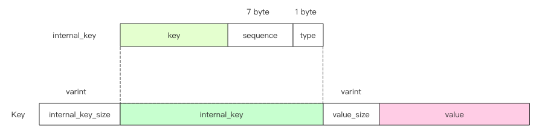

[TOC]

# 读流程的源码分析！

先放代码，可以跳过：

```C++
Status DBImpl::Get(const ReadOptions& options, const Slice& key,
                   std::string* value) {
  Status s;
  MutexLock l(&mutex_);
  SequenceNumber snapshot;
  if (options.snapshot != nullptr) {
    snapshot =
        static_cast<const SnapshotImpl*>(options.snapshot)->sequence_number();
  } else {
    snapshot = versions_->LastSequence();
  }

  MemTable* mem = mem_;
  MemTable* imm = imm_;
  Version* current = versions_->current();
  mem->Ref();
  if (imm != nullptr) imm->Ref();
  current->Ref();

  bool have_stat_update = false;
  Version::GetStats stats;

  // Unlock while reading from files and memtables
  {
    mutex_.Unlock();
    // First look in the memtable, then in the immutable memtable (if any).
    LookupKey lkey(key, snapshot);
    if (mem->Get(lkey, value, &s)) {
      // Done
    } else if (imm != nullptr && imm->Get(lkey, value, &s)) {
      // Done
    } else {
      s = current->Get(options, lkey, value, &stats);
      have_stat_update = true;
    }
    mutex_.Lock();
  }

  if (have_stat_update && current->UpdateStats(stats)) {
    MaybeScheduleCompaction();
  }
  mem->Unref();
  if (imm != nullptr) imm->Unref();
  current->Unref();
  return s;
}
```

## 1. 准备部分

```C++
Status DBImpl::Get(const ReadOptions& options, const Slice& key,
                   std::string* value) {
  Status s;
  MutexLock l(&mutex_);
  SequenceNumber snapshot;
  if (options.snapshot != nullptr) {
    snapshot =
        static_cast<const SnapshotImpl*>(options.snapshot)->sequence_number();
  } else {
    snapshot = versions_->LastSequence();
  }
	
  MemTable* mem = mem_;
  MemTable* imm = imm_;
  Version* current = versions_->current();
  mem->Ref();
  if (imm != nullptr) imm->Ref();
  current->Ref();

  bool have_stat_update = false;
  Version::GetStats stats;
  ...
}
```

这部分是在锁内做的事情，主要就是为了获得对应的版本。

`SequenceNumber`是全局唯一递增的版本号，可以拿当下最新的，也可以从options里面拿需要查的版本号。

然后拿到memtable与immemtable，以及当前的版本信息（这样做可以避免幻读？），再对memtable和immemtable进行引用，防止在查找的时候其他线程对其进行析构。

然后初始化了一个局部结构体stats，结构如下：

```C++
class Version {
 public:
  struct GetStats {
    FileMetaData* seek_file;     // 文件的元数据
    int seek_file_level;		     // 在第几层？
  };
 ...
}
```

我认为拿到序列号与版本、固定table都相当于整个查找操作的“元数据操作”，真正的查找操作是在解锁之后。

## 2. 查找操作

这部分的代码：

```C++
Status DBImpl::Get(const ReadOptions& options, const Slice& key,
                   std::string* value) {
  {
    mutex_.Unlock();
    LookupKey lkey(key, snapshot);
    if (mem->Get(lkey, value, &s)) {
      // Done
    } else if (imm != nullptr && imm->Get(lkey, value, &s)) {
      // Done
    } else {
      s = current->Get(options, lkey, value, &stats);
      have_stat_update = true;
    }
    mutex_.Lock();
  }
}
```

第一个操作是根据key生成用于查找操作的LookupKey，因为memtable里面的key有特定的结构，如下所示，因此这里的Key不能直接拿来搜索。



因此我们再来看LookupKey的构造函数：

```C++
class LookupKey {
public:
  ...
    
// Return a key suitable for lookup in a MemTable.
  Slice memtable_key() const { return Slice(start_, end_ - start_); }

  // Return an internal key (suitable for passing to an internal iterator)
  Slice internal_key() const { return Slice(kstart_, end_ - kstart_); }

  // Return the user key
  Slice user_key() const { return Slice(kstart_, end_ - kstart_ - 8); }
private:
  // We construct a char array of the form:
  //    klength  varint32               <-- start_
  //    userkey  char[klength]          <-- kstart_
  //    tag      uint64
  //                                    <-- end_
  // The array is a suitable MemTable key.
  // The suffix starting with "userkey" can be used as an InternalKey.
  const char* start_;
  const char* kstart_;
  const char* end_;
  char space_[200];  // Avoid allocation for short keys
}

LookupKey::LookupKey(const Slice& user_key, SequenceNumber s) {
  size_t usize = user_key.size();
  // varint32最长为(5) + usize + SequenceNumber(7) + type(1)
  size_t needed = usize + 13;
  char* dst;
  if (needed <= sizeof(space_)) {
    dst = space_;
  } else {
    dst = new char[needed];
  }
  start_ = dst;   // 这里是整个的开头
  dst = EncodeVarint32(dst, usize + 8);
  kstart_ = dst;  // 这里指向实际的internal_key
  std::memcpy(dst, user_key.data(), usize);
  dst += usize;
  EncodeFixed64(dst, PackSequenceAndType(s, kValueTypeForSeek));
  dst += 8;
  end_ = dst;
}
```

因此生成的LookupKey就是图中的`internal_key_size` + `internal_key`部分。

接下来就是逐级查找，查找顺序为memtable->immemtable->level_file，其中对level_file的查找会涉及到缓存的问题，对我这种对缓存高度感兴趣的人而言这部分我还是单开一章好好介绍把，后面将这里的时候会跳过先 : )

### 2.1 查memtable

memtable本身就一个跳表，因此查memtable实际上就是查跳表
